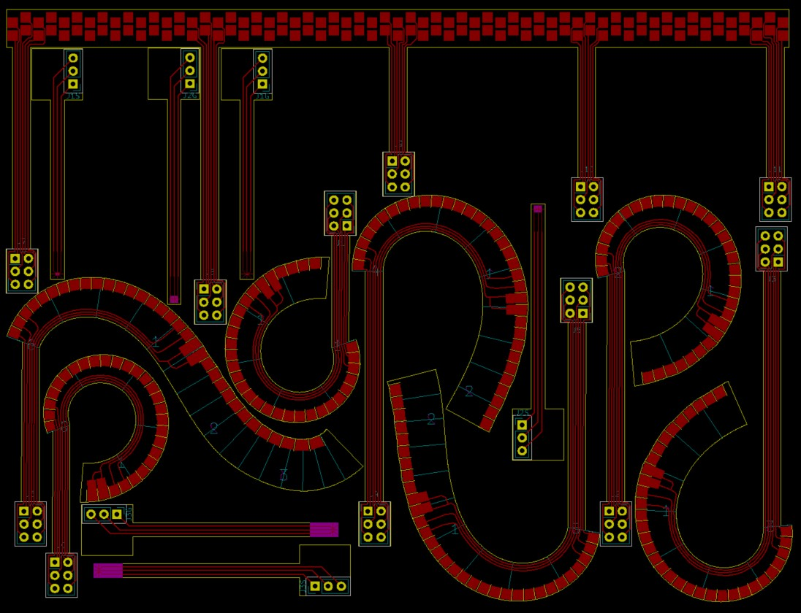
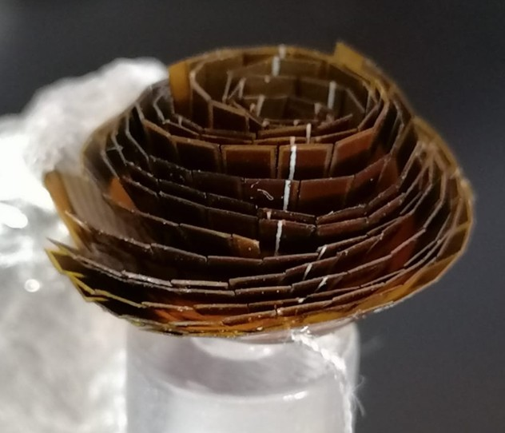

# silverfinger
Metallised coiled finger prototype fabricated by Protoelectronics 2021.

Includes PCB design, which is python code which elaborates kicad templates to create kicad source.

Also includes arduino code for testing prototypes. This includes:

+ interfacing to icub standard capacitive sensor IC.
+ using arduino directly to pulse plates to explore inter-whisker capacitances.

